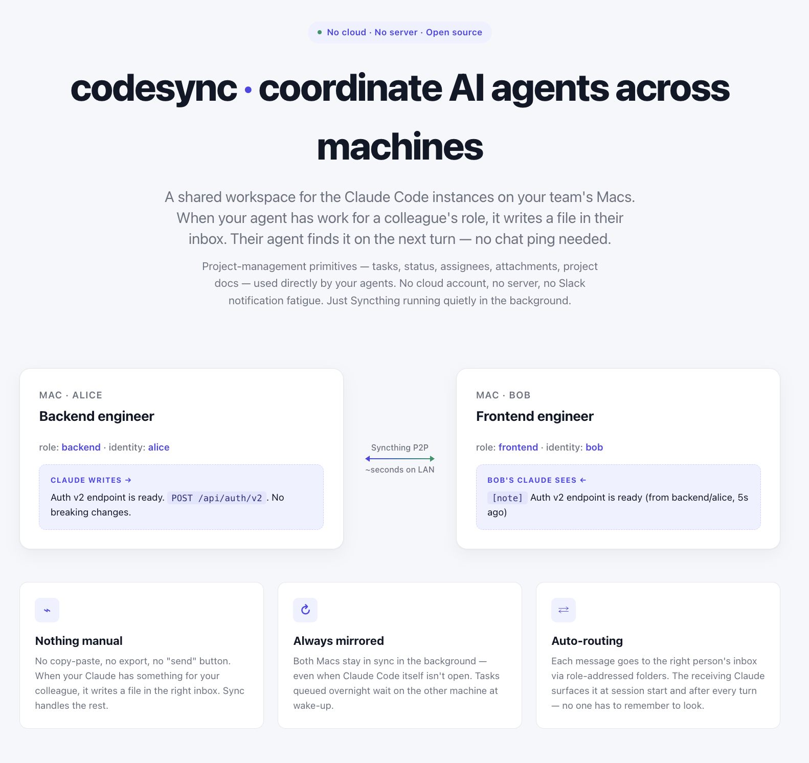
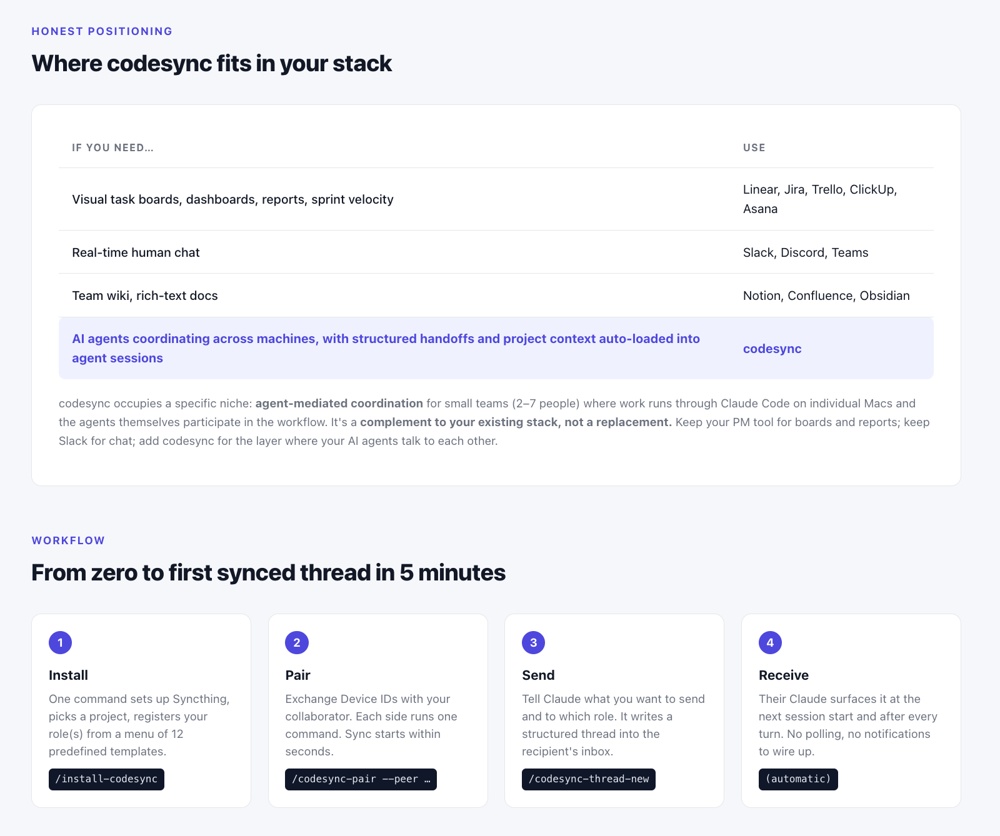
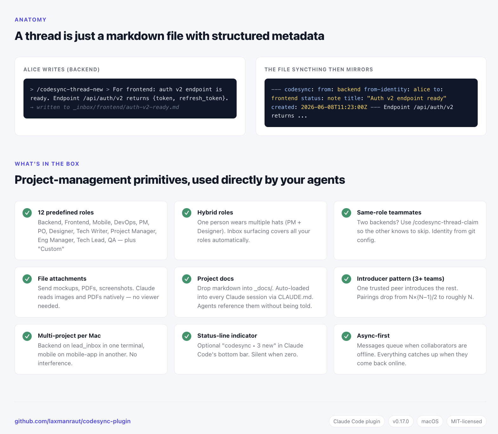

# codesync







**A shared workspace for AI agents on different machines — macOS and Windows.** When your Claude Code instance has something for a colleague's role — a task to hand off, a question to ask, a design to share — it writes a file in their inbox. Their Claude finds it on the next turn. No cloud account, no server, no human-to-human notification ping needed for routine handoffs.

Under the hood: a folder mirrored between your machines (Mac or Windows) by [Syncthing](https://syncthing.net) (free, peer-to-peer, runs quietly in the background). Inside the folder, work is sorted by **role-addressed inboxes** so each thread goes to the right person. The primitives you'd find in a project-management tool — tasks, status, assignees, attachments, project docs — are all here, in plain markdown, used by the agents themselves.

```
    Your machine                          Colleague's machine
  ┌────────────┐                        ┌────────────┐
  │ Claude     │                        │ Claude     │
  │ Code       │                        │ Code       │
  └─────┬──────┘                        └──────┬─────┘
        │  writes a task                       │  reads it,
        │  for "frontend"                      │  replies back
        ▼                                      ▼
  ┌─────────────────┐                    ┌─────────────────┐
  │ ~/codesync/     │   shared folder    │ ~/codesync/     │
  │   project-1/   │ ◄────────────────► │   project-1/   │
  │     _inbox/     │      (Syncthing    │     _inbox/     │
  │       backend/  │      keeps both    │       backend/  │
  │       frontend/ │       in sync)     │       frontend/ │
  └─────────────────┘                    └─────────────────┘
         you                                 colleague
    (role: backend)                       (role: frontend)
```

**Reading the diagram:** the two boxes at the bottom are the same project folder, mirrored on both machines by Syncthing — no server sits between them. When your Claude writes a file into `_inbox/frontend/`, Syncthing copies it to your colleague's matching folder within seconds (on the same LAN) or a minute or two (over the internet). Their Claude picks it up on its next turn. The reply flows back the same way, into `_inbox/backend/`. The role names (`backend`, `frontend`) are just folder names — they decide *who the message is for*, not which machine it lives on.

**Nothing manual, always in sync.** When your Claude has something for your colleague — a new task, a question, a design note, a "done" reply — it writes the file directly into the relevant role's inbox. No copy-paste, no export, no "send" button, no message-broker step. The folder sync runs continuously in the background after install (Syncthing is a small always-on service), so both machines stay in sync even when Claude Code itself isn't open — if your colleague is asleep and you ship five tasks for them, all five are waiting on their machine when they wake up. The receiving Claude picks up new files automatically too: a session-start summary lists what's waiting in the inbox the moment you launch Claude Code, and a post-turn auto-check surfaces anything new that arrived while you were typing. Neither agent ever has to be told "go check the folder" — it's already happening every turn.

## What this is — and what it isn't

Honest framing first, so you know whether to keep reading:

**What codesync IS:**

- **A shared workspace for AI agents** working across machines. Claude on one machine reads what Claude on another wrote — macOS and Windows alike.
- **Structured agent handoffs.** Threads carry `from`, `to`, `status`, attachments, replies, owner — the receiving agent knows exactly how to route, prioritize, and respond.
- **Project-management primitives, used directly by agents.** Tasks, status (`todo`/`wip`/`done`/`blocked`/`note`), assignees (via role + identity + claim), attachments (images, PDFs, mockups), project docs (auto-loaded as context) — all the small-team essentials, in plain markdown files.

**What codesync ISN'T:**

- **Not a replacement for Jira / Linear / Trello / ClickUp.** No visual boards, no dashboards, no velocity reports, no sprint management, no integrations, no mobile. If your team needs those, keep your PM tool.
- **Not a chat app.** No real-time human conversation — Slack, Discord, Teams stay in their lane.
- **Not a team wiki.** The `_docs/` folder is plain markdown reference, not a rich-text wiki.
- **Not a cloud service.** No account, no server, no web or mobile access. Local Macs only, peer-to-peer.

## Compared to other tools

| If you need… | Use |
|---|---|
| Visual task boards, dashboards, reports, sprint velocity | Linear, Jira, Trello, ClickUp, Asana |
| Real-time human chat | Slack, Discord, Teams |
| Team wiki, rich-text docs | Notion, Confluence, Obsidian |
| **AI agents coordinating across machines, with structured handoffs and auto-loaded project context** | **codesync** |

codesync occupies a specific niche: **agent-mediated coordination** for small teams (2–7 people) where work is done through Claude Code on individual machines (macOS or Windows) and the agents themselves participate in the workflow. It's a **complement to your existing stack, not a replacement.** Keep using your PM tool for boards and reports; keep using Slack for chat; add codesync for the layer where your AI agents talk to each other.

## Requirements

- **macOS** or **Windows 10/11**
  - macOS: [Homebrew](https://brew.sh) — Syncthing installs via `brew` and runs as a `brew services` job
  - Windows: `winget` (ships with Windows 10 1709+ / 11 as "App Installer") — the installer fetches Syncthing, and Python too if the machine doesn't have it
- [Claude Code](https://claude.com/claude-code) (its shell runs the plugin's scripts via Git Bash on Windows — nothing to configure)

## Install

In Claude Code:

```
/plugin marketplace add github:laxmanraut/codesync-plugin
/plugin marketplace update codesync-shared
/plugin install codesync@codesync-shared
/reload-plugins
```

The `marketplace update` and `reload-plugins` steps refresh Claude Code's local plugin cache. Without them, the install can complain that the plugin isn't there.

## 5-minute quickstart

A walkthrough from zero to your first synced thread. Each step links to the detailed section below.

**Day 0 — set up your machine.** Run `/install-codesync`. It installs Syncthing once, captures your identity for thread attribution (auto-suggested from your `git config user.name`), asks you to name a project, and shows a numbered role picker (Backend, Frontend, PM, Designer, etc., plus "Custom"). Multi-select is fine — pick `5,7` to register as PM + Designer. Prints your **Device ID**. → See *[First-time setup](#first-time-setup)*.

**Day 0+ — pair with your collaborator.** They install the plugin and run `/install-codesync` with **the same project name**. Then only ONE side needs the other's Device ID: they run `/codesync-pair --peer <your-device-id>`, and at your next Claude session you'll see an **incoming pairing request** banner with the accept command ready to paste. Accept it and Syncthing connects directly; the project folder mirrors between the two machines within seconds. → See *[Pairing with a collaborator](#pairing-with-a-collaborator)*.

**Day 1 — send a thread.** In a terminal with the project + role activated:

```
/codesync-thread-new
```

You'll be asked who the thread is for and what to say. Reply in plain English (*"For frontend: auth v2 endpoint ready at /api/auth/v2…"*). Claude writes it to `_inbox/frontend/<slug>.md` with structured metadata. → See *[Threads](#threads--structured-notes-tasks-and-replies)*.

**Day 1 — receive a thread.** Your collaborator launches Claude. At session start, they see what's waiting in every inbox they're registered for. After every Claude turn, anything new since the last turn surfaces automatically. → See *[How content surfaces to you](#how-content-surfaces-to-you)*.

**Daily workflow:**

- `/codesync-thread-reply <slug>` — auto-addresses back to the original sender.
- `/codesync-thread-set-status <slug> <todo|wip|done|blocked|note>` — move a thread through its lifecycle.
- `/codesync-thread-archive <slug>` — move a resolved thread out of the active inbox.
- `/codesync-thread-attach <slug> <file>...` — attach mockups, PDFs, screenshots to an existing thread. → See *[Sharing non-markdown files](#sharing-non-markdown-files-mockups-pdfs-screenshots)*.
- `/codesync-status` — health check (sync state, peers connected, your identity).

**When your team grows past 2 people:** designate one trusted peer as **introducer**. Others pair with them using `/codesync-pair --peer <id> --as-introducer` — Syncthing then auto-shares the rest of the team. → See *[Teams of 3+](#teams-of-3--use-an-introducer)*.

**When two teammates share the same role** (two backends, two designers): use `/codesync-thread-claim <slug>` to take a thread so the other knows to skip it. Each thread carries `from-identity: alice` so attribution is clear. → See *[Two teammates in the same role](#two-teammates-in-the-same-role)*.

**For project-wide reference docs** (architecture, conventions, glossary): drop markdown files in `~/codesync/<project>/_docs/`. They sync to every collaborator and surface in every Claude session via a project-level `CLAUDE.md` that's auto-loaded. → See *[Project-wide docs and CLAUDE.md auto-loading](#project-wide-docs-_docs-and-claudemd-auto-loading)*.

## First-time setup

```
/install-codesync
```

This will:

1. Install Syncthing if needed (Homebrew on macOS; winget on Windows, which also auto-installs Python when missing) and start it in the background.
2. Save your Syncthing API key and Device ID.
3. Ask you to pick or create a **project** (e.g. `project-1`, `mobile-app`). Each project becomes its own Syncthing folder at `~/codesync/<project>/`. If projects already exist on this machine, a numbered picker shows them plus a "New project" option.
4. Show a numbered **role picker** with 12 predefined roles across Engineering, Product & Design, and Project & People — pick one or more (comma-separated). Hybrid is fine: pick `5,7` for "Product Manager + Designer" in one go. Option 13 is "Custom (free-form)" for roles outside the curated list. Each pick comes with a starter `Owns` / `Does not own` template you can edit before saving.
5. Print the activation command:
   ```
   export CODESYNC_PROJECT=<project> CODESYNC_ROLE=<primary-role>
   ```

If you register multiple roles (e.g. PM + Designer), the post-turn inbox check and session-start summary will automatically cover ALL of them. You only need to switch `CODESYNC_ROLE` when you want to *send* messages "as" the other hat — receiving covers everything.

## How a terminal picks its project and role

Project and role are **per-terminal** — each shell decides independently which project it's working on and which role you're "wearing" right now. Two mechanisms, checked in this order:

### 1. Environment variables (explicit, always wins)

```
export CODESYNC_PROJECT=project-1
export CODESYNC_ROLE=backend
claude
```

Inside Claude Code, `/codesync-status` confirms both are set.

**A `cs` wrapper for `~/.zshrc`** that makes switching painless:

```bash
cs() {
  case $# in
    2)
      export CODESYNC_PROJECT="$1"
      export CODESYNC_ROLE="$2"
      echo "CodeSync: project=$CODESYNC_PROJECT role=$CODESYNC_ROLE"
      ;;
    1)
      export CODESYNC_ROLE="$1"
      echo "CodeSync: project=${CODESYNC_PROJECT:-(unset)} role=$CODESYNC_ROLE"
      ;;
    0)
      echo "Usage: cs <project> <role>   or   cs <role>"
      echo "Current: project=${CODESYNC_PROJECT:-(unset)} role=${CODESYNC_ROLE:-(unset)}"
      ;;
    *)
      echo "Usage: cs <project> <role>   or   cs <role>"
      return 1
      ;;
  esac
}
```

After reloading your shell (`source ~/.zshrc`):

```
$ cs project-1 backend
$ claude
> /codesync-status
  Active project: project-1
  Active role:    backend

# Different terminal, different combo:
$ cs mobile-app frontend
```

### 2. Directory marker (auto-detected when env vars aren't set)

You can avoid setting env vars in every terminal by *attaching* a directory to a project. Any Claude session launched from inside that directory (or any subdirectory) auto-resolves the project.

```
cd ~/code/lead-inbox-app
/codesync-project-attach project-1 backend
```

That drops a small `.codesync/project.json` marker in the directory — the resolver walks UP from cwd to find it. The marker can be committed to git so your collaborator gets the same default, or `.gitignore`'d if you prefer it private.

`/codesync-project-attach` also offers to **symlink the project's `CLAUDE.md`** into the directory — once it's symlinked, Claude Code's native CLAUDE.md mechanism auto-loads project context from any session launched here (and updates flow through automatically because it's a symlink to the synced file). Refuses to overwrite a real CLAUDE.md you already have.

**Precedence:** env var wins over marker. So you can have a marker setting one project, and override per-terminal with `export CODESYNC_PROJECT=otherproject`.

**Auto-offer from `/codesync-role-new`:** running `/codesync-role-new` in a terminal where no project is active walks you through picking (or creating) a project, then offers to drop a marker in the current directory automatically. The offer is guarded against general-purpose locations (`~`, `/tmp`, `/`) — in those it defaults to *no* with a warning, since a marker there would affect every terminal launched from your home.

## Adding another project

```
/codesync-project-new
```

Walks through naming + creates a new Syncthing folder + scaffold. After it runs, set `CODESYNC_PROJECT=<new-name>` in your shell (or use `cs <new-name> <role>`) and start `/codesync-role-new` inside the new project to register roles for it.

**Shortcut:** `/codesync-role-new` and `/codesync-thread-new` both fall back to a project picker if no project is active in the terminal — so you can skip the explicit `/codesync-project-new` step and just run `/codesync-role-new` directly. The picker will offer existing projects plus "New project (enter name)" as the last option.

## Pairing with a collaborator

After both of you have a project of the same name (e.g. both ran `/install-codesync` with project `project-1`), only **one** Device ID needs to change hands — the joining side needs yours (printed by install or `/codesync-status`).

The joining side runs, in a terminal where `CODESYNC_PROJECT=project-1` is set:

```
/codesync-pair --peer <your-device-id>
```

This pairs the devices AND invites the peer to the active project's folder. On **your** side, the request shows up automatically — an **incoming pairing request** banner at your next Claude session start (and in `/codesync-status`), naming the requesting device with the accept command ready to paste:

```
[codesync] 1 incoming pairing request(s) — a device added this machine and is waiting:
  - "colleague-win11"  ABCDEFG-...  (first seen: 2026-06-12T09:14:02Z)
    Accept: /codesync-pair --peer ABCDEFG-...
```

Run that accept command (with your `CODESYNC_PROJECT` set) and sync starts. The displayed name is self-declared by the requester, so verify the ID matches what your collaborator sent you before accepting — mutual explicit trust is what keeps strangers out of your folder; codesync makes it one paste, but never automatic.

If you want to invite an **already-paired** peer to a **different** project, set `CODESYNC_PROJECT` to that other project and run `/codesync-pair --peer <id>` again — the command is smart about it. The device-pair step is a no-op (idempotent PUT) when the peer is already known, but the project-invite still runs. One command for both fresh pairing and additional-project invites.

### Teams of 3+ — use an introducer

Pairing two people is straightforward — each side runs `/codesync-pair` once and you're done. But with N people, the naive approach needs each person to pair with every other person: that's N×(N−1)/2 pairings, plus everyone has to swap Device IDs with everyone.

CodeSync uses Syncthing's **introducer** model to collapse this. Designate one trusted peer as the introducer (often the person who set the project up). Everyone else pairs *with the introducer* and passes `--as-introducer`:

```
/codesync-pair --peer <introducer-device-id> --as-introducer
```

Syncthing then automatically tells your machine about every other peer the introducer is connected to in the shared folder — you don't have to pair with them by hand. Total pairings drop from N×(N−1)/2 to roughly N.

**The flag is one-way and set on YOUR side.** When you pass `--as-introducer`, you are saying "*my* machine trusts this peer to introduce other teammates to *me*." The introducer themselves doesn't run `--as-introducer` — they just pair normally. Per Syncthing's own guidance, two peers should NOT mark each other as introducers; the relationship is intentionally directional.

**Workflow for a 3-person team (Alice = introducer, Bob and Carol join):**

1. Bob pairs with Alice using `--as-introducer`:
   ```
   /codesync-pair --peer <alice-device-id> --as-introducer
   ```
   Alice pairs back with Bob normally (no `--as-introducer` on Alice's side — she's the introducer, not the introduced).
2. Carol joins later. She runs the same as Bob did:
   ```
   /codesync-pair --peer <alice-device-id> --as-introducer
   ```
   Alice pairs back with Carol normally.
3. Bob's machine now learns about Carol automatically through Alice — no Bob↔Carol pairing needed. Carol's machine likewise learns about Bob through Alice. Same for every future teammate Alice adds.

**When to use it:**
- 2 people total → don't bother, just pair directly.
- 3+ people → pick one introducer; everyone else `--as-introducer`s through them. The introducer themselves does nothing special — they pair normally with each new teammate.

**Trust trade-off:** an introducer can add new devices to your Syncthing instance. Only mark someone as introducer if you'd be okay with them telling your machine about a new teammate. For most small teams that's fine; for adversarial settings, pair manually.

If you already paired with the introducer normally and want to upgrade, just rerun the pair command with `--as-introducer` — it's idempotent and only ever upgrades the flag, never downgrades.

## File layout inside a project

```
~/codesync/<project>/
├── CLAUDE.md                # project context, auto-loaded by Claude Code
├── _roles/                  # role definitions for this project
│   ├── backend.md
│   ├── frontend.md
│   └── README.md
├── _inbox/                  # role-addressed content
│   ├── backend/             # things addressed TO backend in this project
│   └── frontend/            # things addressed TO frontend in this project
└── _docs/                   # project-wide reference docs (shared with all roles)
    ├── ARCHITECTURE.md
    ├── CONVENTIONS.md
    ├── GLOSSARY.md
    └── README.md
```

When you have content for another role, drop it under `_inbox/<their-role>/`. When they reply, they drop it under `_inbox/<your-role>/`.

## Project-wide docs (`_docs/`) and `CLAUDE.md` auto-loading

Two pieces, working together, make every collaborator's Claude aware of project-wide context without anyone having to say "read the docs":

**`_docs/`** is a free-form directory of markdown reference files — architecture notes, conventions, glossary, decisions log, anything every collaborator should be able to read. Files sync to all paired peers within seconds. Create files by hand or with Claude; no slash command needed for creation. `/codesync-doc-list` shows what's there.

**`CLAUDE.md`** is dropped at the project root by `/install-codesync` and `/codesync-project-new`. Claude Code natively auto-loads any file named `CLAUDE.md` in the working directory or any ancestor — no plugin involvement needed for the loading itself. The starter template:

- Explains the folder layout (`_roles/`, `_inbox/`, `_archive/`, `_docs/`).
- Includes a **"Default behaviors for Claude"** section that makes the plugin feel ambient. Agents auto-read `_docs/` before answering questions about project structure or conventions; auto-read role profiles before routing; **suggest** thread-creation, claims, attachments when the user's intent is clear; and never silently archive, release, or mark threads done. (Tier 1: silent auto. Tier 2: suggest then wait for yes. Tier 3: never automatic — explicit user instruction required.)
- Has a "Notes for the team" section for the user's project-specific additions.

Edit it to add project-specific instructions (vocabulary, ways of working, "always check X before doing Y") and every collaborator's Claude picks them up after the next Syncthing sync. The template has a sentinel comment at the end (`<!-- codesync-template-v2 -->`); removing that comment opts out of future auto-refreshes during `/install-codesync` re-runs, so any custom edits are preserved.

**How agents reference docs automatically — two layers, working together:**

1. **Native CLAUDE.md loading** (preferred path). If your Claude session's working directory is *inside* the synced project folder (`~/codesync/<project>/`), Claude Code's built-in CLAUDE.md mechanism walks up and auto-loads the file — no plugin involvement needed.

2. **SessionStart hook fallback** (for typical workflows). Most users work from their **code repository** (e.g. `~/code/<app>/`), not from inside the synced folder. The synced CLAUDE.md is invisible to Claude Code's native loader in that case, because it only walks UP from cwd. To fix this, the SessionStart hook detects when your cwd is outside the synced project and **injects the CLAUDE.md content** into the session — so the agent has project context regardless of where you launched from.

   The hook also lists `_docs/` filenames (with first heading) so agents know what reference docs exist without reading them all into context.

3. **For the cleanest experience** (combines both layers): run `/codesync-project-attach <project>` inside your code directory. It writes a `.codesync/project.json` marker so terminals launched here auto-detect the project, AND it offers to drop a `CLAUDE.md` symlink pointing at the synced version. With the symlink in place, Claude Code's native loader picks up the synced CLAUDE.md directly (no hook injection needed), and any update from a collaborator flows through automatically.

Edit conflicts: Syncthing is last-write-wins. If two collaborators edit the same doc at the same time, both versions are preserved under `.stversions/` for recovery — no automatic merge.

**For projects created before v0.14:** re-run `/install-codesync` and pick your existing project from the picker. The seeder is idempotent — it only adds the missing files (`_docs/`, `_docs/README.md`, `CLAUDE.md`) and leaves anything already in place. If your CLAUDE.md is the older default template (no `Default behaviors for Claude` section), the install command will offer to refresh it to the current template — declining preserves your existing file untouched.

## Two teammates in the same role

Sometimes you have two (or more) people on the team playing the same role — two backend engineers, two designers, etc. In that case, threads addressed `to: backend` land in a single shared inbox that both backends see. Without coordination, both might pick up the same task, or neither does because each thinks the other will.

codesync handles this with **identity** and **claim**:

**Identity** — captured during `/install-codesync` (auto-suggested from your `git config user.name`, or you type it). Stored on your machine, attached to every thread you write as `from-identity`. So a thread shows `(from backend/alice)` rather than just `(from backend)` — readers can tell which backend sent it.

**Claim** — when a backend wants to take a thread from the shared inbox:

```
/codesync-thread-claim <slug>
```

This sets `owner: alice` in the thread's frontmatter and (by default) flips `status: todo → wip`. The other backend's session-start summary, post-turn check, and `/codesync-thread-list` all label the thread `[owned by alice]` so they know to skip it. To return a thread to the unclaimed pool, run the same command with `--release`: `/codesync-thread-claim <slug> --release`.

The claim script refuses to overwrite an existing claim by someone else — best-effort race protection. If two people claim at the exact same instant, Syncthing's last-write-wins decides, and both copies are preserved in `.stversions/` for recovery.

If you'd rather have completely separate inboxes (e.g., two backends own different parts of the system), use distinct role names instead — `backend-api` and `backend-data`, for example. The current plugin handles that pattern with zero special-casing.

## Sharing non-markdown files (mockups, PDFs, screenshots)

Threads are markdown, but you'll often want to send images, PDFs, HTML mockups, or other files alongside them — a design role sending login mockups to frontend, a PM sharing a spec PDF, a designer dropping screen recordings. Two-step pattern:

1. Write a thread describing what you're sending: `/codesync-thread-new` → *"For frontend: login mockup v1 attached, focus on the form-validation states."*
2. Attach the files: `/codesync-thread-attach <slug> <file-path> [<file-path>...]`

Example:

```
/codesync-thread-attach login-mockup-v1 ~/Desktop/login.png ~/Desktop/profile.png ~/Desktop/cart.png
```

Files are copied into `_inbox/<role>/<slug>.attachments/<filename>` (a per-thread subdirectory next to the thread file), syncing to every paired peer within seconds. The thread's frontmatter records the attachment list:

```yaml
codesync:
  ...
  attachments: login.png, profile.png, cart.png
```

The thread listing, the post-turn auto-check, and the session-start summary all show `[+ 3 attachments]` next to the title so the recipient knows there's more than just text. The attachments themselves are first-class files on disk that any tool can read.

Claude is multimodal — once a file lands on the recipient's machine, they can ask their Claude *"open `login.png` and tell me what's on it"* and Claude reads the image / PDF directly. No special viewer needed.

Re-attaching a file with the same name overwrites it (the previous version is preserved in `.stversions/` by Syncthing) — useful for shipping "v2 of this mockup" without changing the thread. Attachments move along with the thread when you `/codesync-thread-archive <slug>` (or `/codesync-thread-archive <slug> --unarchive`).

Constraint: attachment filenames cannot contain commas (the frontmatter field is comma-separated). Spaces and special characters are fine.

## Threads — structured notes, tasks, and replies

A *thread* is a markdown file with a small YAML header that declares who wrote it, who it's for, what status it has, and (optionally) what earlier thread it replies to. Threads live in role-addressed inboxes inside a project: `_inbox/<recipient-role>/<slug>.md`.

### Frontmatter shape

```markdown
---
codesync:
  from: backend
  from-identity: alice    # auto-included; the human who wrote this
  to: frontend
  status: todo            # todo | wip | done | blocked | note
  owner: bob              # optional; set by /codesync-thread-claim
  title: "Auth v2 endpoint ready to wire up"
  created: 2026-06-06T01:23:00Z
  replies-to: _inbox/backend/auth-v2-question.md   # optional, for replies
---

# Auth v2 endpoint ready to wire up

(write your note / task / discussion here)
```

Status semantics:
- `todo` / `wip` / `done` / `blocked` — actionable items the recipient role is meant to act on (or report back on).
- `note` — informational. No workflow expectation; just context, a decision, a question, an FYI, design discussion.

Roles aren't restricted to one status convention — same `to`-role can receive a mix of tasks and notes.

### Slash commands for threads

See the **[Slash command reference](#slash-command-reference)** at the bottom of this README for the full list of thread commands and their flags — `thread-new`, `thread-list`, `thread-reply`, `thread-set-status`, `thread-archive`, `thread-unarchive`, `thread-claim`, `thread-release`, `thread-attach`. Kept as one master table to avoid drift.

### Auto-check enrichment

When the post-turn Stop hook surfaces a new/changed thread file, it reads the frontmatter to show:

```
[codesync project=project-1, role=backend] 1 change(s) for you:
  + [todo] Refactor lead inbox pagination (from frontend)  _inbox/backend/refactor-lead-inbox-pagination.md
```

Files without frontmatter (free-form markdown you write by hand) still surface, just without the status/title prefix.

## How content surfaces to you

Three places, ordered by when they fire:

### At session start

When you launch Claude Code in a terminal with `CODESYNC_PROJECT` (and `CODESYNC_ROLE`) set, a SessionStart hook surfaces what's waiting in your inbox before you type anything:

```
[codesync] Project: project-1  Role: backend
  Inbox: 3 todo, 1 wip, 2 notes

    [todo]     Migrate to JSON Patch for partial updates (from frontend/alice, 2d ago)
    [wip]      Lead inbox PR 3a [owned by bob] (from backend/bob, 5h ago)
    [todo]     Refactor pagination (from frontend/alice, 3d ago)
    [note]     Login mockup v1 [+ 2 attachments] (from design/carol, 1d ago)
    [note]     Feature-flag rollout plan (from devops/dan, 6h ago)
    …and 2 more

  Project docs (3) — read any with Claude when relevant:
    - ARCHITECTURE.md  — System component overview
    - CONVENTIONS.md   — Code style and naming
    - DECISIONS.md     — Accepted decision log

  Run /codesync-thread-list to see them, or /codesync-thread-reply <slug> to respond.
```

Hybrid roles see all their inboxes grouped by role. If your cwd is outside the synced project folder, the hook also injects the project's `CLAUDE.md` content into the session (since Claude Code's native loader can't reach a CLAUDE.md outside cwd's ancestors).

If the inbox is empty and there are no project docs to surface, the hook stays silent.

### After every Claude turn

A Stop hook walks the active project's folder and surfaces anything that arrived, changed, or got deleted since the last turn. Each surfaced thread also gets a one-line body preview, so the receiver immediately sees *what* the message says, not just that it exists:

```
[codesync project=project-1, role=frontend] 1 change(s) for you:
  + [todo] Roll out checkout flag to 10% (from pm/dave)  _inbox/frontend/feature-flag-rollout.md
      > "Enable the new-checkout feature flag for 10% of users next Tuesday. Monitor error rates closely…"
```

Filtered to items addressed to your registered roles (under `_inbox/<role>/` or `_archive/<role>/`) plus role-profile changes; other changes collapse to a one-line "N changes outside your inbox" count.

Attachment-file events are grouped under their parent thread automatically — if a designer ships 3 mockups via `/codesync-thread-attach`, the recipient sees ONE event with `[+ 3 attachments]` rather than 4 (the modified thread + 3 attachment file lines).

When the new behaviors are loaded (via the v3 CLAUDE.md template — see *[Project-wide docs and CLAUDE.md auto-loading](#project-wide-docs-_docs-and-claudemd-auto-loading)*), Claude also **proactively reads the full contents** of any new threads on the next turn before responding, so the agent already has the context in mind by the time you ask about them.

When `CODESYNC_PROJECT` isn't set, the hook stays silent.

### In Claude Code's status bar (optional)

A small live indicator in the bottom strip showing unread-inbox counts:

```
codesync ▴ 3 new
```

Per-terminal — each Claude Code session shows the count for its active project + role(s). When the count is zero, the indicator stays silent (no real estate used).

**One-time install:**

```
/codesync-statusline-setup
```

Safely adds the codesync segment to `~/.claude/settings.json` statusLine. Backs up the file first, captures any existing statusLine command, wraps both so they compose cleanly — non-destructive. To remove later: `/codesync-statusline-teardown` restores the prior command.

The status line refreshes every few seconds. Sending any message forces an immediate refresh.

**Real-time alert when something new arrives.** When a never-seen-before thread lands, the status-line script fires a native notification — a macOS banner with the "Glass" alert sound, or a Windows toast — *"2 new threads in project-1"* — so you don't have to be looking at the bottom bar to know something arrived. A shared first-seen log deduplicates across sessions: one arrival means one notification total, no matter how many Claude windows are open, and a thread already surfaced by the post-turn check won't toast again. No extra install on either platform; macOS asks for notification permission once.

## Autopilot — queued threads get picked up even when Claude isn't open

The inbox is already a durable queue: threads wait on disk, delivered by Syncthing, surviving reboots and offline periods. By default they're consumed when you next open Claude Code. The **autopilot** closes the remaining gap — pickup with nobody at the keyboard.

```
/codesync-autopilot on
```

Installs a per-project background job (`launchd`; **currently macOS-only** — Windows Task Scheduler support is on the roadmap) that polls every 15 minutes, around the clock. Each cycle:

1. A **zero-token pre-check** (pure bash) looks for never-before-processed threads in your registered roles' inboxes. Nothing new → exit. A quiet inbox costs nothing.
2. If new threads exist, a **headless Claude session** (`claude -p`) triages them:
   - **Questions answerable from project-local knowledge** (`_docs/`, `_roles/`, existing threads) get an automatic reply — tagged `generated-by: auto` in frontmatter and `[auto]` in every listing, so humans always know which replies came from a machine.
   - **Everything else** — tasks, code work, anything requiring judgment — stays untouched in the inbox for you.

**Safety rails (all enforced in the runner, not just prompt-level):**

- **Loop brake #1:** autopilots never process threads tagged `generated-by: auto` — so two machines' autopilots can't ping-pong each other.
- **Loop brake #2:** each thread is processed at most once, ever (tracked in local state).
- **Rate cap:** max 4 headless runs per rolling hour (override via `CODESYNC_AUTOPILOT_MAX_RUNS_PER_HOUR`).
- **Narrow permissions:** the headless session is restricted to reading files and invoking the thread-writing script — it cannot claim, archive, change status, or touch anything outside the inbox.

`/codesync-autopilot status` shows whether the job is loaded, recent runs, and the log tail. `/codesync-autopilot off` removes it. Activity is logged to `~/.config/codesync/autopilot-<project>.log` — check it each morning to see what your agent did overnight.

**Cost note:** each run that finds new threads is a real Claude API session. Quiet cycles are free; busy days cost roughly one short session per batch of arrivals, capped by the rate limit.

## Archiving resolved threads

As threads accumulate, you'll want to move resolved/stale ones out of the active inbox without deleting them. Use `/codesync-thread-archive <slug>` — it moves the file from `_inbox/<role>/<slug>.md` to `_archive/<role>/<slug>.md`. The file is preserved with its frontmatter and body intact (plus any attachments — those move along with the thread); it just stops appearing in `/codesync-thread-list`'s default view.

```
~/codesync/project-1/
├── _inbox/<role>/        ← active work, surfaced everywhere
└── _archive/<role>/      ← preserved history, hidden by default
```

To see archived items: `/codesync-thread-list --archive` (only archive) or `/codesync-thread-list --include-archive` (both, with `[archived]` label on archived rows). To bring something back: `/codesync-thread-archive <slug> --unarchive`.

Status (`todo`/`wip`/`done`/`blocked`/`note`) and archive are **orthogonal**: a `done` thread can stay in the inbox until acknowledged, then be archived; a `todo` thread can be archived if deferred. Two separate dials.

The post-turn auto-check and session-start summary continue to surface changes in `_archive/`, but with a `[archived]` prefix so they're visually distinct from active inbox work.

## Slash command reference

| Command | What it does |
|---|---|
| `/install-codesync` | First-time setup: Syncthing, project picker (existing or new), role picker (12 predefined roles with templates, multi-select for hybrid). Also auto-offers to install the status-line indicator and the `cs` shell wrapper. |
| `/codesync-project-new` | Register an additional project. |
| `/codesync-project-attach <project> [<role>]` | Drop a `.codesync/project.json` marker in the current dir so terminals launched here auto-resolve the project. Also offers to symlink the project's `CLAUDE.md` into the directory so Claude Code natively auto-loads project context. |
| `/codesync-pair --peer <id> [--as-introducer]` | Pair with a peer + invite to the active project. Smart: if the peer is already device-paired, just adds them to the current project. Pass `--as-introducer` for the introducer pattern (see "Teams of 3+" above). |
| `/codesync-role-new` | Register one OR MORE roles (hybrid supported) in a project. Numbered picker of 12 predefined roles + "Custom"; each pick has a starter template you can edit. Offers a project picker (existing + "New project") if none is active, then offers to drop a marker in the current directory. |
| `/codesync-thread-new` | Start a new thread (note / task / decision / question) addressed to another role. Offers project + role pickers if either is unset in the terminal. |
| `/codesync-thread-list` | List threads in your role's inbox (or all inboxes with `--all`); filter by status. `--archive` / `--include-archive` for archived items. Offers a project picker if none active. |
| `/codesync-thread-reply <slug>` | Reply to an existing thread; auto-addresses the reply back to the original sender. |
| `/codesync-thread-set-status <slug> <status>` | Move a thread between `todo` / `wip` / `done` / `blocked` / `note` without hand-editing. |
| `/codesync-thread-claim <slug> [--release]` | Claim a thread (sets `owner: <your-identity>` and flips `todo→wip`). Pass `--release` to give it back to the unclaimed pool. For teams where two+ people share a role. |
| `/codesync-thread-archive <slug> [--unarchive]` | Move a thread from `_inbox/<role>/` to `_archive/<role>/`. File preserved, just out of default views. Pass `--unarchive` to reverse. Attachments move along. |
| `/codesync-thread-attach <slug> <file>...` | Attach one or more files (images, PDFs, HTML mockups, anything) to an existing thread. Files sync alongside the thread; listings show `[+ N attachments]`. |
| `/codesync-doc-list` | List project-wide docs in `_docs/` — filename + first heading + size. Read-only; ask Claude to read any specific doc afterwards. |
| `/codesync-autopilot [on\|off\|status]` | Background pickup of queued threads: a launchd job polls every 15 min and a headless Claude auto-replies to doc-answerable questions (tagged `[auto]`). Loop brakes + 4-runs/hour cap built in. _(macOS-only today; Windows Task Scheduler support planned.)_ |
| `/codesync-statusline-setup` | Install codesync's status-line segment (shows `codesync ▴ N new` in Claude Code's bottom bar when there are unread items). Backs up settings.json. (Auto-offered during `/install-codesync`.) |
| `/codesync-statusline-teardown` | Remove codesync's status-line segment; restore prior statusLine. |
| `/codesync-status` | When `CODESYNC_PROJECT` is set: active project + role, Syncthing health, peers, folder sync state, registered roles. When unset: lists every project on this machine + their registered roles. |

All commands except `/install-codesync`, `/codesync-project-new`, and `/codesync-status` require `CODESYNC_PROJECT` to be set in the terminal.
